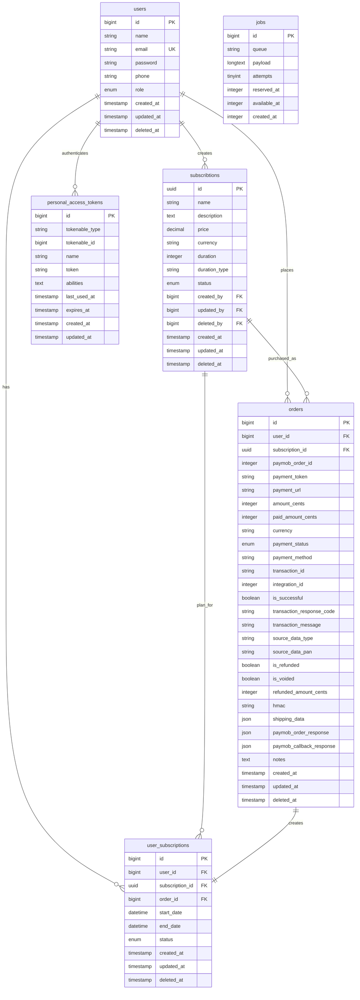

# Subscription Management System API - Technical Documentation

<div align="center">
  
  
  
  
</div>

## 📋 Project Overview

This repository contains a **Subscription Management System API** built with Laravel 11. The system provides a complete backend service for managing subscriptions for a learning platform, including user authentication, subscription CRUD operations, payment processing via Paymob, and administrative functionality.

## ✅ Requirements Fulfillment

### Core Business Requirements

-   ✅ **Authentication System**: Laravel Sanctum-based authentication with user registration and login
-   ✅ **Subscription Management**: Complete CRUD operations for subscription plans
-   ✅ **Payment Gateway Integration**: Full Paymob integration with payment session creation and callback handling
-   ✅ **User Subscription Tracking**: Automatic subscription activation upon successful payment
-   ✅ **Admin Endpoints**: User listing and subscription deactivation functionality

### Authentication Requirements

-   ✅ **User Registration**: Secure registration with password validation (uppercase, lowercase, number, special character)
-   ✅ **User Login**: Token-based authentication using Laravel Sanctum
-   ✅ **Protected Routes**: All API routes except login/register are protected with `auth:sanctum` middleware
-   ✅ **Role-Based Access**: Admin and user roles with appropriate access control

### Payment Gateway Integration

-   ✅ **Paymob Integration**: Complete payment flow implementation
-   ✅ **Payment Session Creation**: Generate payment URLs for frontend integration
-   ✅ **Callback Handling**: Secure webhook/callback processing with HMAC verification
-   ✅ **Order Management**: Comprehensive order tracking with payment status
-   ✅ **Subscription Activation**: Automatic user subscription creation on successful payment

### Technical Requirements

-   ✅ **RESTful Design**: Proper HTTP methods, status codes, and resource-based URLs
-   ✅ **Data Validation**: Comprehensive input validation with Form Requests
-   ✅ **Stateless Authentication**: Sanctum tokens with proper middleware
-   ✅ **Error Handling**: Consistent error responses and proper HTTP status codes
-   ✅ **Database Migrations**: Well-structured migrations with relationships and indexes
-   ✅ **Seeders**: Admin user and subscription plan seeding
-   ✅ **Background Jobs**: Automated subscription expiration using queued jobs
-   ✅ **Scheduled Tasks**: Cron-based subscription expiration every 10 minutes

## 🏗️ Technical Implementation

### Architecture & Design Patterns

**Clean Architecture Implementation:**

-   **Service Layer**: Business logic encapsulated in dedicated services with interfaces
-   **Action Pattern**: Single-purpose action classes for complex operations (e.g., `GeneratePaymobTokenAction`, `CalculateSubscribtionEndDateAction`)
-   **Form Request Validation**: Dedicated validation classes for input sanitization
-   **Trait Pattern**: Reusable traits for common functionality (e.g., `MakesHttpRequests`, `ResponseTrait`)
-   **Repository Pattern**: Data access abstraction through service interfaces

**Key Architectural Decisions:**

```php
// Service Layer Pattern
class PaymobPaymentService implements PaymentGatewayInterface
{
    public function sendPayment(array $data): array
    public function callBack(array $data): void
}

// Action Pattern for Complex Operations
class GeneratePaymobTokenAction
{
    public function handle(): string
    {
        // Token generation logic
    }
}

// Trait for Reusability
trait MakesHttpRequests
{
    protected function buildRequest(string $url, array $data): array
    {
        // HTTP request building logic
    }
}
```

### Security Implementation

**Laravel Sanctum Authentication:**

-   Secure token-based authentication
-   Configurable token expiration
-   Proper token validation middleware
-   CSRF protection for web routes

**Role-Based Access Control:**

-   Admin and user role differentiation
-   Route-level middleware protection
-   User role validation in business logic
-   Admin-only endpoints for user management

**Input Validation:**

-   Comprehensive form request validation
-   Strong password requirements (regex validation)
-   Business rule validation (e.g., subscription status rules)
-   SQL injection prevention through Eloquent ORM
-   XSS protection through Laravel's built-in escaping

**Payment Security:**

-   HMAC verification for payment callbacks
-   Secure payment token generation
-   Transaction status validation
-   Order integrity checks

### Database Design

**Optimized Schema:**

```sql
-- Core Tables with Proper Relationships
users (id, name, email, password, phone, role, timestamps)
subscribtions (id [UUID], name, description, price, currency, duration, duration_type, status, created_by, timestamps)
orders (id, user_id, subscription_id, paymob_order_id, payment_token, payment_url, amount_cents, currency, payment_status, ...)
user_subscriptions (id, user_id, subscription_id, order_id, start_date, end_date, status, timestamps)
```

**Key Features:**

-   UUID primary keys for subscriptions (better security and distribution)
-   Foreign key constraints for data integrity
-   Soft deletes for data retention
-   Proper indexing for query optimization
-   JSON fields for flexible data storage (shipping_data, payment responses)
-   Comprehensive order tracking with payment details

**Entity Relationship Diagram:**



### API Design

**RESTful Endpoints:**

```
Authentication:
POST   /api/auth/register          # User registration
POST   /api/auth/login             # User login
POST   /api/auth/logout            # User logout (protected)
POST   /api/auth/refresh-token     # Refresh authentication token (protected)

Subscription Management:
GET    /api/subscription/list      # List all subscription plans (protected)
GET    /api/subscription/detail/{id}  # Get subscription details (protected)
POST   /api/subscription/create    # Create new subscription plan (protected)
PUT    /api/subscription/update/{id}  # Update subscription plan (protected)
DELETE /api/subscription/delete/{id}  # Delete subscription plan (protected)

Payment Processing:
POST   /api/payment/pay            # Initiate payment (protected, throttled)
GET    /api/payment/callback       # Payment callback/webhook (public)

User Management (Admin):
GET    /api/users/list             # List all users with subscriptions (protected, admin)
PATCH  /api/users/subscriptions/{id}/deactivate  # Deactivate user subscription (protected, admin)
```

**Request/Response Examples:**

```bash
# Register User
POST /api/auth/register
{
  "name": "John Doe",
  "email": "john@example.com",
  "password": "SecurePass123!",
  "password_confirmation": "SecurePass123!",
  "phone": "01000000000"
}

# Login
POST /api/auth/login
{
  "email": "john@example.com",
  "password": "SecurePass123!"
}

# Create Payment
POST /api/payment/pay
Authorization: Bearer {token}
{
  "amount_cents": 5000,
  "currency": "EGP",
  "subscription_id": "uuid-here",
  "shipping_data": {
    "first_name": "John",
    "last_name": "Doe",
    "email": "john@example.com",
    "phone_number": "01000000000"
  }
}
```

### Payment Flow

**Paymob Integration Flow:**

1. **Token Generation**: Generate authentication token from Paymob API
2. **Order Creation**: Create order in Paymob system with subscription details
3. **Payment Key Request**: Request payment key for the created order
4. **Iframe URL Generation**: Generate payment URL for frontend integration
5. **Callback Processing**: Handle payment callback with HMAC verification
6. **Subscription Activation**: Create/update user subscription on successful payment
7. **Order Status Update**: Update order status and transaction details

**Payment Callback Handling:**

-   HMAC verification for security
-   Transaction status validation
-   Automatic subscription activation
-   Previous subscription expiration
-   Comprehensive error logging

### Background Jobs & Scheduling

**Automated Subscription Expiration:**

-   **Job**: `ExpireSubscriptionsJob` - Queued job for expiring subscriptions
-   **Command**: `subscriptions:expire` - Console command to dispatch the job
-   **Schedule**: Runs every 10 minutes via Laravel scheduler
-   **Features**:
    -   Automatic retry on failure (3 attempts with 60-second backoff)
    -   Comprehensive logging
    -   Bulk update for efficiency
    -   Prevents overlapping executions

## 📊 Technical Highlights

### Advanced Features Implemented

**Subscription Management:**

```php
// Automatic end date calculation
class CalculateSubscribtionEndDateAction
{
    public function handle(int $duration, string $durationType): Carbon
    {
        return match($durationType) {
            'month' => now()->addMonths($duration),
            'year' => now()->addYears($duration),
            default => now()->addDays($duration),
        };
    }
}
```

**Payment Service Architecture:**

```php
// Extensible payment gateway interface
interface PaymentGatewayInterface
{
    public function sendPayment(array $data): array;
    public function callBack(array $data): void;
}

// Paymob implementation
class PaymobPaymentService implements PaymentGatewayInterface
{
    // Complete Paymob API integration
    // Order creation, payment key generation, callback handling
}
```

**User Subscription Management:**

```php
// Automatic subscription expiration on new purchase
UserSubscription::where('user_id', $userId)
    ->where('status', 'active')
    ->update(['status' => 'expired']);

// Create new active subscription
UserSubscription::create([
    'user_id' => $userId,
    'subscription_id' => $subscriptionId,
    'order_id' => $orderId,
    'start_date' => now(),
    'end_date' => $endDate,
    'status' => 'active',
]);
```

**Role-Based Access Control:**

```php
// Admin check in controllers
if (!auth()->user()->isAdmin()) {
    return response()->json(['message' => 'Unauthorized'], 403);
}

// User scope filtering
User::with('userSubscriptions')->users()->get();
```

## 🚀 Setup & Usage

### Prerequisites

-   PHP 8.2 or higher
-   Composer
-   MySQL 5.7+ or MariaDB 10.3+
-   Node.js and NPM (for frontend assets if needed)

### Quick Start

```bash
# Clone the repository
git clone <repository-url>
cd anasco

# Install dependencies
composer install

# Environment setup
cp .env.example .env
php artisan key:generate

# Configure database in .env
DB_CONNECTION=mysql
DB_HOST=127.0.0.1
DB_PORT=3306
DB_DATABASE=anasco
DB_USERNAME=your_username
DB_PASSWORD=your_password
DB_COLLATION=utf8mb4_unicode_ci

# Configure Paymob credentials in .env
PAYMOB_API_KEY=your_api_key
PAYMOB_INTEGRATION_ID=your_integration_id
PAYMOB_IFRAME_ID=your_iframe_id
PAYMOB_HMAC_SECRET=your_hmac_secret

# Run migrations
php artisan migrate

# Seed database
php artisan db:seed

# Start the development server
php artisan serve
```

### Queue Worker Setup

For background jobs to work, start the queue worker:

```bash
# Development
php artisan queue:work

# Production (with supervisor)
php artisan queue:work --daemon
```

### Scheduler Setup

For scheduled tasks, add this to your server's crontab:

```bash
* * * * * cd /path-to-your-project && php artisan schedule:run >> /dev/null 2>&1
```

Or use Laravel's schedule worker for development:

```bash
php artisan schedule:work
```

### Access Points

-   **API Base**: `http://localhost:8000/api`
-   **Health Check**: `http://localhost:8000/up`

### Default Credentials

After seeding, you can login with:

-   **Admin Email**: `admin@anasco.com`
-   **Admin Password**: `password`

## 📁 Project Structure

```
app/
├── Actions/
│   ├── CalculateSubscribtionEndDateAction.php
│   └── Payments/
│       └── GeneratePaymobTokenAction.php
├── Console/
│   └── Commands/
│       └── ExpireSubscriptionsCommand.php
├── Http/
│   ├── Controllers/
│   │   └── Api/
│   │       ├── AuthController.php
│   │       ├── PaymentController.php
│   │       ├── SubscriptionController.php
│   │       └── UsersController.php
│   └── Requests/
│       ├── Auth/
│       │   └── RegisterRequest.php
│       └── PaymentRequest.php
├── Jobs/
│   └── ExpireSubscriptionsJob.php
├── Models/
│   ├── Order.php
│   ├── Subscribtion.php
│   ├── User.php
│   └── UserSubscription.php
├── Services/
│   ├── Interfaces/
│   │   ├── AuthInterface.php
│   │   ├── PaymentGatewayInterface.php
│   │   ├── SubscribtionInterface.php
│   │   └── UserInterface.php
│   └── Implementations/
│       ├── AuthService.php
│       ├── Payments/
│       │   ├── BasePaymentService.php
│       │   └── PaymobPaymentService.php
│       ├── SubscribtionService.php
│       └── UserService.php
└── Traits/
    ├── MakesHttpRequests.php
    └── ResponseTrait.php

database/
├── migrations/
│   ├── 0001_01_01_000000_create_users_table.php
│   ├── 0001_01_01_000001_create_cache_table.php
│   ├── 0001_01_01_000002_create_jobs_table.php
│   ├── 2025_12_11_155350_create_personal_access_tokens_table.php
│   ├── 2025_12_11_164219_create_subscribtions_table.php
│   ├── 2025_12_11_192244_create_orders_table.php
│   └── 2025_12_11_195203_create_user_subscriptions_table.php
└── seeders/
    ├── AdminUserSeeder.php
    ├── DatabaseSeeder.php
    └── SubscribtionSeeder.php

routes/
├── api/
│   ├── api.php
│   ├── AuthRoutes.php
│   ├── PaymentRoutes.php
│   ├── SubscriptionRoutes.php
│   └── UsersRoutes.php
├── console.php
└── web.php
```

## 🧪 Quality Assurance

### Code Quality

-   **PSR-12 Compliance**: Laravel Pint for code formatting
-   **Type Declarations**: Full type hints throughout codebase
-   **Documentation**: Comprehensive PHPDoc comments
-   **Error Handling**: Consistent exception handling with proper logging
-   **Database Transactions**: ACID compliance for data integrity

### Performance Considerations

-   **Query Optimization**: Eager loading to prevent N+1 queries
-   **Database Indexing**: Proper indexes for frequently queried fields
-   **Bulk Operations**: Efficient bulk updates for subscription expiration
-   **Queue Processing**: Background job processing for heavy operations
-   **Stateless Design**: Sanctum authentication for horizontal scaling

### Security Features

-   **Password Hashing**: Bcrypt password hashing
-   **Strong Password Policy**: Regex validation for password strength
-   **HMAC Verification**: Secure payment callback validation
-   **SQL Injection Prevention**: Eloquent ORM with parameter binding
-   **XSS Protection**: Laravel's built-in output escaping
-   **CSRF Protection**: Token-based CSRF protection
-   **Rate Limiting**: Throttling on payment endpoints

## 🎯 Technical Skills Demonstrated

### Backend Development

-   **Laravel Framework**: Advanced usage of Laravel 11 features
-   **RESTful API Design**: Proper HTTP methods and status codes
-   **Authentication/Authorization**: Laravel Sanctum and RBAC implementation
-   **Database Design**: Normalized schema with proper relationships
-   **Validation**: Comprehensive input validation and sanitization
-   **Payment Gateway Integration**: Complete Paymob API integration

### Software Engineering

-   **Clean Architecture**: Separation of concerns and SOLID principles
-   **Design Patterns**: Service, Action, Repository, and Trait patterns
-   **Error Handling**: Consistent exception handling and logging
-   **Background Processing**: Queue jobs and scheduled tasks
-   **Code Quality**: PSR-12 compliance and type safety

### DevOps & Tools

-   **Version Control**: Git with proper commit history
-   **Documentation**: Comprehensive API documentation
-   **Queue Management**: Laravel queue system for background jobs
-   **Task Scheduling**: Laravel scheduler for automated tasks
-   **Performance**: Query optimization and efficient database operations

## 🔮 Future Enhancements

While the current implementation fully satisfies all requirements, potential improvements include:

-   **Stripe Integration**: Add Stripe as an alternative payment gateway
-   **Email Notifications**: Send emails on subscription activation/expiration
-   **Subscription Renewal**: Automatic renewal functionality
-   **Analytics Dashboard**: Subscription metrics and reporting
-   **Multi-currency Support**: Enhanced currency handling
-   **Subscription Upgrades/Downgrades**: Plan change functionality
-   **Trial Periods**: Free trial subscription support
-   **Webhook Retry Logic**: Enhanced webhook reliability

## 📝 Environment Variables

Required environment variables:

```env
# Application
APP_NAME="Anasco Subscription System"
APP_ENV=local
APP_KEY=
APP_DEBUG=true
APP_URL=http://localhost:8000

# Database
DB_CONNECTION=mysql
DB_HOST=127.0.0.1
DB_PORT=3306
DB_DATABASE=anasco
DB_USERNAME=root
DB_PASSWORD=
DB_COLLATION=utf8mb4_unicode_ci

# Paymob
PAYMOB_API_KEY=your_api_key
PAYMOB_INTEGRATION_ID=your_integration_id
PAYMOB_IFRAME_ID=your_iframe_id
PAYMOB_HMAC_SECRET=your_hmac_secret

# Queue
QUEUE_CONNECTION=database
```

## 📄 License

This project is open-sourced software licensed under the [MIT license](https://opensource.org/licenses/MIT).

---

**Thank you for reviewing this technical documentation.**
